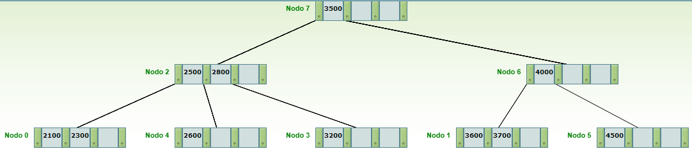

# Archivo de datos

<table align="center">
<tr>
    <th>DNI</th> <th>Legajo</th> <th>Nombre y Apellido</th> <th>Salario</th>
</tr>

<tr>
    <td>35.000.000</td><td>100</td><td>Juan Perez</td><td>$250000</td>
</tr>

<tr>
    <td>40.000.000</td><td>101</td><td>Lucio Redivio</td><td>$400000</td>
</tr>

<tr>
    <td>32.000.000</td><td>102</td><td>Nicolás Lapro</td><td>$720000</td>
</tr>

<tr>
    <td>28.000.000</td><td>103</td><td>Luis Scola</td><td>$2000000</td>
</tr>

<tr>
    <td>26.000.000</td><td>104</td><td>Andres Nocioni</td><td>$1500000</td>
</tr>

<tr>
    <td>37.000.000</td><td>105</td><td>Facundo Campazzo</td><td>$1200000</td>
</tr>

<tr>
    <td>25.000.000</td><td>106</td><td>Emanuel Ginobili</td><td>$5000000</td>
</tr>

<tr>
    <td>23.000.000</td><td>107</td><td>Pepe Sanchez</td><td>$1000000</td>
</tr>

<tr>
    <td>21.000.000</td><td>108</td><td>Alejandro Montecchia</td><td>$800000</td>
</tr>

<tr>
    <td>36.000.000</td><td>109</td><td>Marcos Delia</td><td>$300000</td>
</tr>

<tr>
    <td>45.000.000</td><td>110</td><td>Leandro Bolmaro</td><td>$600000</td>
</tr>
</table>

# Arbol de indices

    

