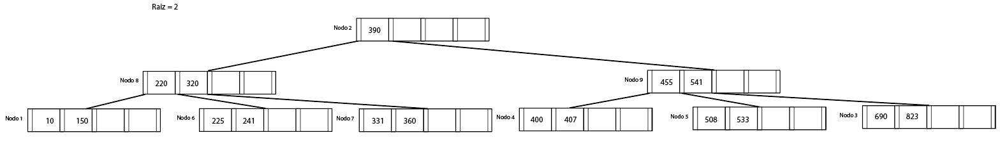
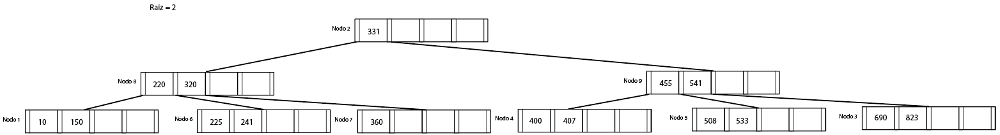
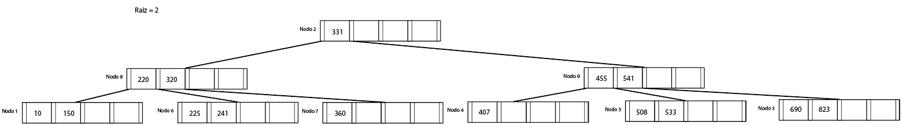
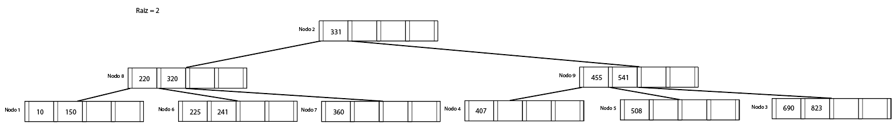

# Ejercicio 7

### Arbol Inicial

    

### Inserción de la clave 320

Ocurre **Overflow** en el nodo 1, debemos redistribuir

    

### Eliminación de la clave 390

Ocurre **Underflow** en el nodo 2, se utiliza la politica izquierda para realizar la redistribucion, se busca cual es el mas clave que puede ser el nuevo elemento de la raiz y se encuentra que es 331 (debido a que es mayor a 220 y menor que 455) por lo que pasa a ser la nuevo elemento del nodo raiz.

    

### Eliminación de la clave 400

No ocurre ningun problema en la eliminacion de la clave, ahora el primer elemento del nodo 4 es la clave 407.

    

### Eliminación de la clave 533

No ocurre ningun problema en la eliminacion de la clave, el nodo 5 quesa solo con la clave 533

    

